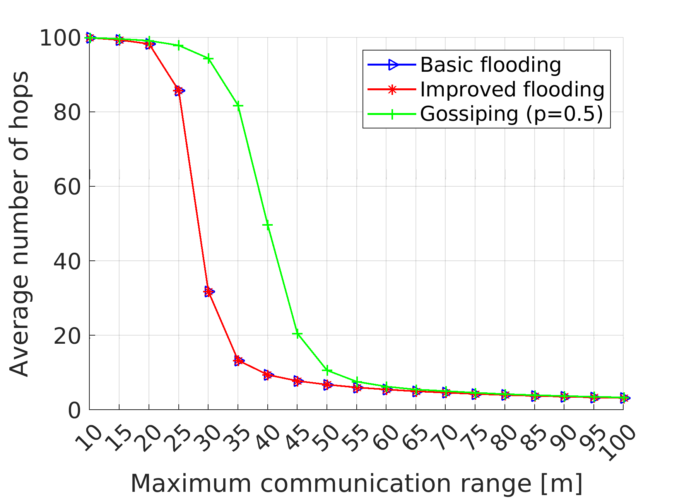
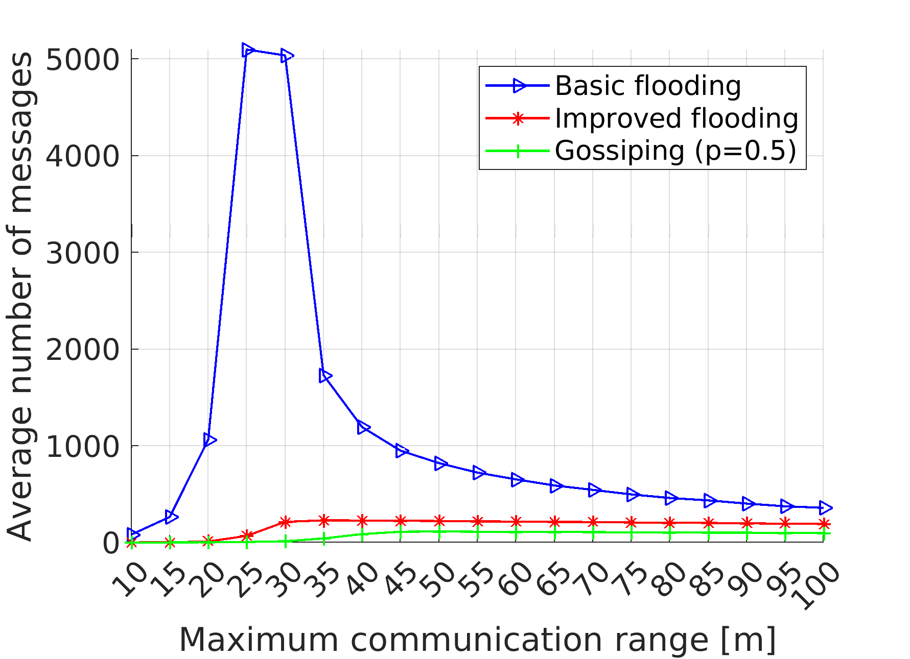

# Simulation of the flooding protocol

This repo contains my solution to one homework from Wireless Systems. It evaluates [flooding](https://en.wikipedia.org/wiki/Flooding_%28computer_networking%29) routing protocol in wireless sensor networks (or MANETs).

### Assignemnt
We were given a template `Flooding_Template.m` file with basic structure indication via steps such as:
```
%%%%%%%%%%%%%%%%%%%%%%%%%%%%%%%%%%
%1. Step: Define basic parameters%
%%%%%%%%%%%%%%%%%%%%%%%%%%%%%%%%%%
```
we were also provided with the plotting section at the end. The goal was to implement the algorithm based on lecture to get plots like these:
<p align="center">
  
  
</p>

### NOTE:
- It is a Monte Carlo Simulation, so there is a little bit of variance permitted.
- the parameter `Sim_drops = 1000;` controls the vairance vs. time to compute tradeoff.
